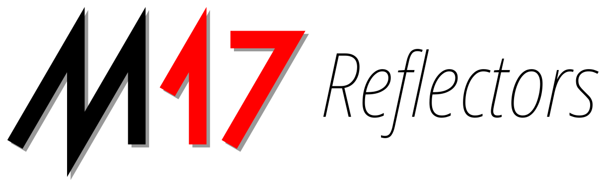

<a name="readme-top"></a>

[![Contributors][contributors-shield]][contributors-url]
[![Forks][forks-shield]][forks-url]
[![Stargazers][stars-shield]][stars-url]
[![Issues][issues-shield]][issues-url]
[![GPL License][license-shield]][license-url]
[![Build Status][build-shield]][build-url]


<br />
<div align="center">
  <a href="https://github.com/kc1awv/gomrefdash">
    
  </a>

<h3 align="center">gomrefdash</h3>

  <p align="center">
    mrefd Dashboard, in Go!
    <br />
    <a href="https://github.com/kc1awv/gomrefdash"><strong>Explore the docs »</strong></a>
    <br />
    <br />
    <a href="https://github.com/kc1awv/gomrefdash">View Demo</a>
    ·
    <a href="https://github.com/kc1awv/gomrefdash/issues">Report Bug</a>
    ·
    <a href="https://github.com/kc1awv/gomrefdash/issues">Request Feature</a>
  </p>
</div>


<details>
  <summary>Table of Contents</summary>
  <ol>
    <li>
      <a href="#about-the-project">About The Project</a>
      <ul>
        <li><a href="#built-with">Built With</a></li>
      </ul>
    </li>
    <li>
      <a href="#getting-started">Getting Started</a>
      <ul>
        <li><a href="#prerequisites">Prerequisites</a></li>
        <li><a href="#installation">Installation</a></li>
      </ul>
    </li>
    <li><a href="#usage">Usage</a></li>
    <li><a href="#roadmap">Roadmap</a></li>
    <li><a href="#contributing">Contributing</a></li>
    <li><a href="#license">License</a></li>
    <li><a href="#contact">Contact</a></li>
    <li><a href="#acknowledgments">Acknowledgments</a></li>
  </ol>
</details>


## About The Project

[![Product Name Screen Shot][product-screenshot]](https://ref.m17.link)

A dashboard written for mrefd 0.5.0+ in Go!

<p align="right">(<a href="#readme-top">back to top</a>)</p>


### Built With

* [![Go][Go.dev]][Go-url]
* [![Bootstrap][Bootstrap.com]][Bootstrap-url]
* [![JQuery][JQuery.com]][JQuery-url]
* [![Vue][Vue.js]][Vue-url]

<p align="right">(<a href="#readme-top">back to top</a>)</p>


## Getting Started

Clone, build, and run!

### Prerequisites

Install Go 1.19+ according to your platform, directions can be found [here](https://go.dev/doc/install)

### Installation

1. Clone the repo
   ```sh
   git clone https://github.com/kc1awv/gomrefdash.git
   ```
2. Build the application
   ```sh
   make
   ```
3. Copy gomrefdash.sample.toml and edit to your environment
    ```sh
    cp gomrefdash.sample.toml to gomrefdash.toml
    ```

4. Run gomrefdash
   ```sh
   ./gomrefdash
   ```

<p align="right">(<a href="#readme-top">back to top</a>)</p>

## Advanced (Experimental)

These are some things that aren't officially supported, but you can try it out.
### Docker

#### Some Assumptions

1. mrefd is already running on the system running docker.

2. You are familiar with docker and it's installed on your system - https://www.docker.com

3. You have docker-compose installed - https://docs.docker.com/compose/install/

#### Quickstart

1. Copy docker-compose.sample.yml to docker-compose.yml

2. Edit the docker-compose.yml for your environment

3. Run ```docker-compose up```

4. Open http://localhost:3000

You will need to put a proxy in front of your application, or modify the docker-compose file to add nginx or caddy.  That is left as an exercise for the admin as the choices are various.  Many of us prefer caddy as it has automatic ssl via letsencrypt.

To upgrade, ```git pull && docker-compose down && docker-compose build && docker-compose up -d```

Check with ```docker-compose logs -f``` (hit ctrl-c to stop log streaming)

### Makefile

The makefile has various convience functions:

* ```make``` (no parameters), builds the binary for your system

* ```make run``` runs the application (without building a binary)

* ```make docker``` builds a docker image with the application

* ```make clean``` cleans old builds

* ```make package``` builds and packages everything up into a tarball for your system

## Roadmap

- [x] Beta Release
- [x] Refresh page on log file changes, instead of a meta refresh in browser - thanks AC8ZD
- [x] Create two-column layout for Modules In Use, instead of a single column
- [ ] Add country flags for callsigns

See the [open issues](https://github.com/kc1awv/gomrefdash/issues) for a full list of proposed features (and known issues).

<p align="right">(<a href="#readme-top">back to top</a>)</p>


## Contributing

Contributions are what make the open source community such an amazing place to learn, inspire, and create. Any contributions you make are **greatly appreciated**.

If you have a suggestion that would make this better, please fork the repo and create a pull request. You can also simply open an issue with the tag "enhancement".
Don't forget to give the project a star! Thanks again!

1. Fork the Project
2. Create your Feature Branch (`git checkout -b feature/AmazingFeature`)
3. Commit your Changes (`git commit -m 'Add some AmazingFeature'`)
4. Push to the Branch (`git push origin feature/AmazingFeature`)
5. Open a Pull Request

<p align="right">(<a href="#readme-top">back to top</a>)</p>


## License

Distributed under the GPL 3.0 License. See `LICENSE.txt` for more information.

<p align="right">(<a href="#readme-top">back to top</a>)</p>


## Contact

* M17 Project Discord - [![Discord][Discord]][Discord-url]

Project Link: [https://github.com/kc1awv/gomrefdash](https://github.com/kc1awv/gomrefdash)

<p align="right">(<a href="#readme-top">back to top</a>)</p>


## Acknowledgments

* [Tom N7TAE](https://github.com/n7tae) _Creator of mrefd and inspiration for development_
* [Dave AC8ZD](https://github.com/dbehnke) _Beta testing and great feedback, page refresh code, many improvements_
* edgetriggered _Teaching me finer points of Golang, help and guidance_

<p align="right">(<a href="#readme-top">back to top</a>)</p>


[contributors-shield]: https://img.shields.io/github/contributors/kc1awv/gomrefdash.svg?style=for-the-badge
[contributors-url]: https://github.com/kc1awv/gomrefdash/graphs/contributors
[forks-shield]: https://img.shields.io/github/forks/kc1awv/gomrefdash.svg?style=for-the-badge
[forks-url]: https://github.com/kc1awv/gomrefdash/network/members
[stars-shield]: https://img.shields.io/github/stars/kc1awv/gomrefdash.svg?style=for-the-badge
[stars-url]: https://github.com/kc1awv/gomrefdash/stargazers
[issues-shield]: https://img.shields.io/github/issues/kc1awv/gomrefdash.svg?style=for-the-badge
[issues-url]: https://github.com/kc1awv/gomrefdash/issues
[license-shield]: https://img.shields.io/github/license/kc1awv/gomrefdash.svg?style=for-the-badge
[license-url]: https://github.com/kc1awv/gomrefdash/blob/master/LICENSE.txt
[build-shield]: https://img.shields.io/github/actions/workflow/status/kc1awv/gomrefdash/audit.yml?style=for-the-badge
[build-url]: https://github.com/kc1awv/gomrefdash/actions/workflow/status/kc1awv/gomrefdashaudit.yml
[product-screenshot]: Screenshot_2023-01-06_13-26-05.png
[Bootstrap.com]: https://img.shields.io/badge/Bootstrap-563D7C?style=for-the-badge&logo=bootstrap&logoColor=white
[Bootstrap-url]: https://getbootstrap.com
[Go.dev]: https://img.shields.io/github/go-mod/go-version/kc1awv/gomrefdash?style=for-the-badge
[Go-url]: https://go.dev/
[JQuery.com]: https://img.shields.io/badge/jQuery-0769AD?style=for-the-badge&logo=jquery&logoColor=white
[JQuery-url]: https://jquery.com 
[Vue.js]: https://img.shields.io/badge/Vue.js-35495E?style=for-the-badge&logo=vuedotjs&logoColor=4FC08D
[Vue-url]: https://vuejs.org/
[Discord]: https://img.shields.io/discord/771492414120656907?style=for-the-badge
[Discord-url]: https://discord.gg/G8zGphypf6
